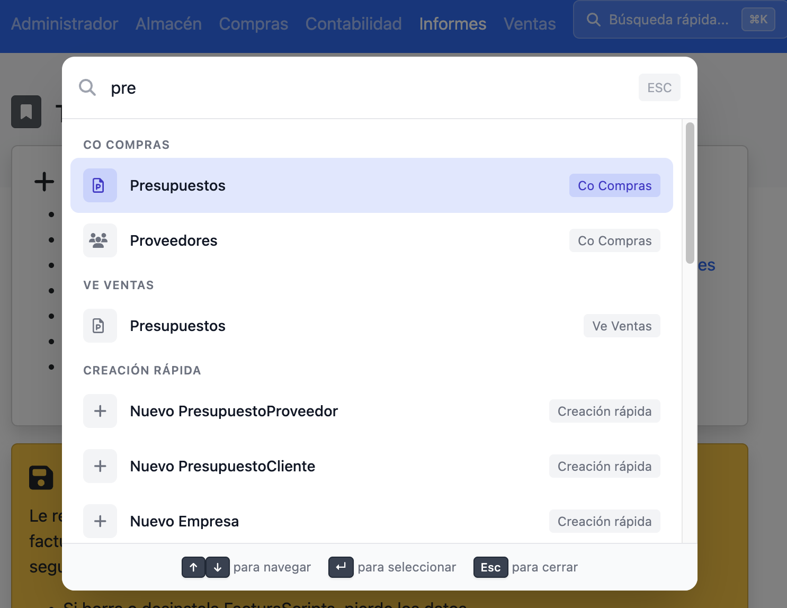

# CommandPalette para FacturaScripts

Paleta de comandos moderna para FacturaScripts, inspirada en VS Code, GitHub y Cloudflare. Navega rápidamente por toda la aplicación usando el teclado.

  

## Características

- **Paleta de comandos**: Pulsa `Ctrl+K` (Windows/Linux) o `Cmd+K` (Mac) para abrir el buscador
- **Búsqueda difusa**: Encuentra opciones escribiendo solo unas letras
- **Creación rápida**: Comandos automáticos "Nuevo Producto", "Nuevo Cliente", etc.
- **Atajos de teclado**: `Alt+N` para crear registro, `Alt+S` para guardar
- **Navegación con teclado**: Flechas arriba/abajo, Enter para seleccionar, Escape para cerrar

## Atajos de teclado

| Acción | Windows/Linux | Mac |
|--------|---------------|-----|
| Abrir paleta | `Ctrl+K` | `Cmd+K` |
| Nuevo registro | `Alt+N` | `Option+N` |
| Guardar | `Alt+S` | `Option+S` |

## Instalación

1. Descarga el ZIP desde [Releases](../../releases/latest)
2. Ve a **Panel de Admin > Plugins** en FacturaScripts
3. Sube el archivo ZIP y activa el plugin

## Licencia

LGPL-3.0. Ver [LICENSE](LICENSE) para más detalles.
